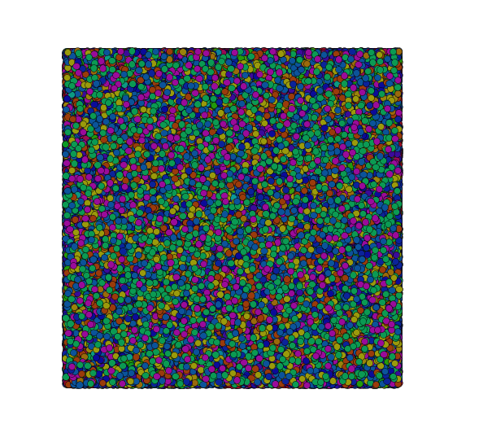

Renren-Social-Analysis
======================

This is the my Social Analysis of my [`renren`](http://www.renren.com) network.

First, run `myFriends.py`, then you will get all `ids` and `names` of all your friends. 
Then, run `friendsFriends.py`, and it will write into file `data.csv` in certain format.

Open `data_tag.csv` and `data.csv` in Gephi. Be patient since the file is large. Customize your own configs and output the visulized image.

My analysis is as followed.

